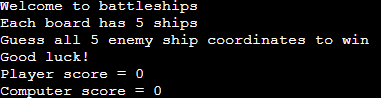
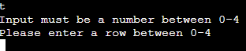
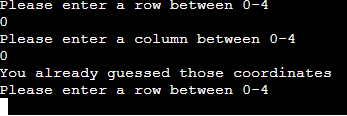
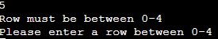
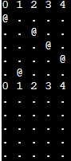
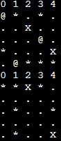

# Battleships

A recreating of the board game Battleships played against the computer made in the Python terminal.

## Game Rules

The player and computer have 5 battleships, randomly allocated on 5x5 grid

The player and computer guess coordinates on the grid, if there is a ship at those coordinates, a battleship is sunk and a point is gained.

First to sink all 5 battleships wins.

If the player and computer sink all battleships simultaneously, it is a draw.

## Features

### Welcome Message

This brief message welcomes the player to the game and explains what they must do to win the game. 

The scores are also displayed here.

### Input

The input box asks the player to input a number between 0-4 for a row and the again for a column.

If the player enters coordinates that are not an integer, is a pair of coordinates they have already guessed or not on the board they are met with an error message and asked to retry their guess.

### Game Board

The game board shows the coordinates 0-4, before any inputs are made the player can see only their own ship locations marked as "@".

When the player makes inputs, they can see the location they guessed and the location the computer guessed.

Successful hits are marked a "X" and misses are marked as "*"

## Testing

All code passes through the [Code Institute PEP8 Validator](https://pep8ci.herokuapp.com/) without any issues.

The program produces the expected results when inputs are entered including invalid inputs.

## Deployment

This project was deployed to Heroku at the [this location](https://dashboard.heroku.com/apps/battleships-project-ci)

The steps for deployment are as follows:

1. Sign up for Heroku

2. Go to the dashboard and create a new app

3. Give the app a name and assign it a region, then click "create appp".

4. In the settings page give the app a config var with a key of "PORT" and a value of "8000"

5. Still in settings, add two buildpacks, Python and Node.js, making sure they are added in that order.

6. In the deployment page, the app is connected to my github account and repository.

This app automatically deploys itself when any new code is pushed to Github.

## Credits

### Knowledge Mavens

I used [this youtube video](https://www.youtube.com/watch?v=tF1WRCrd_HQ&t=746s) to help with the function for adding ships to the boards.

### Code Institute

This project uses a Code Institute gitpod templace [found here](https://github.com/Code-Institute-Org/python-essentials-template) 